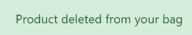

# Inline-6 Overnight

[View the live project here.](https://inline-6-overnight.herokuapp.com/)

This is the e-Commerce website of Inline-6 Overnight, a company that specializes in the procurement, resale, shipment and delivery of specific, brand new straight-six combustion engines at the best available prices, delivering them the next business day. It provides engine solutions to professional tuning shops, automobile repair businesses, garages, workshops, car service specialists and private owners. It’s designed to be a very simple-to-use and functional website, and also responsive and accessible on a range of devices, making it easy to navigate for any potential customers.

## Marketing Strategy

### E-Commerce Application Type

#### Who are the customers?

Engine replacement/tuning is mostly done by professional tuning shops, automobile repair shops, garages, workshops and car service specialists. They usually order parts whenever the service required by their customers needs them – including engines. Nowadays, these businesses will order any parts from their suppliers almost exclusively online. As businesses, and because engines are a very technical and expensive product, they will need a lot of detailed information before they make a purchase (to compare with what other online engine suppliers offer, for example), so this e-Commerce website will be mostly B2B-oriented. A few car enthusiasts who own their own residential garage are brave enough to order parts online directly and install them by themselves – even engines (when it comes to engines, given their size, weight and complexity, this is less common, but it happens) but, because this kind of product is so technically complex and expensive, these potential customers, who have to know about auto mechanics, will never be impulsive buyers and will look for as much detailed information as possible and, just like auto businesses, they’ll look around for the best deal for as long as it takes, so, again, this website will have to be mostly B2B-oriented. The goal is to convert any first-time-ordering customers into returning customers, and this specific business type definitely offers that possibility.

#### What will they buy?

Inline-six engines (internal combustion engines with six cylinders mounted in a straight line), specifically the five best inline-six engines in the world: Toyota’s 2JZ-GTE, Nissan’s RB26DETT, BMW’s S54, Ford's Barra and BMW's M88. This is a physical product, so a lot of detail needs to be shown to the website user – name, description, price, shipping/delivery costs, postal address to ship the engines to, images of the engines, etc.: these fields will be included in the database models that’ll be used on this website (no need to include, for example, product ratings/reviews, as these engines are some of the best in the world and are made by some of the best car brands in the world – the car community/businesses know how good they are – and the same applies to search and filter results – only five engines will be sold). There’s also another separate product that will be sold – a digital product: car tuning software, so there’s instant access to this product when payment is complete, and the storage of this product will be handled on the database as well.

#### How will they pay?

Engines are very expensive, so they’re not the kind of part auto businesses usually have in stock. They’ll only order an engine when one of their customers needs one. Because the service of replacing an engine is also quite expensive, engine replacements are not as common as other auto repair services for smaller/less expensive parts, so auto businesses will not be subscription customers of any engine supplier like Inline-6 Overnight. Instead, they’ll pay as they go (buy directly on the website via a single payment every time they decide to order an engine).

### Web Marketing

#### Who are the users?

Professional tuning shops, automobile repair shops, garages, workshops and car service specialists (very few individual users).

#### Which online platforms would Inline-6 Overnight find lots of its users? Would its users use social media? If so, which platforms would Inline-6 Overnight find them on?

Most car people in the world can usually be found online on blogs dedicated to cars (it’s very common in the car enthusiasts’ community worldwide). People who own a tuning shop or an automobile repair shop that still works with internal combustion engines, for example, will probably be in the 30-55 age group. According to [Khoros](https://khoros.com/resources/social-media-demographics-guide), 77% of people aged 30-49 use Facebook, and 51% of people aged 50-65 use Facebook (more than Instagram, Twitter, etc.), making Facebook the perfect social media platform to find users for a website that sells internal combustion engines. YouTube has a large audience in this age group, too, but the cost of creating professional video content makes it prohibitive for many businesses, including Inline-6 Overnight, and it wouldn’t suit a company that is basically an engine reseller (not a lot of useful/relevant video content can be created, the company doesn’t even provide any auto repair or tuning services that could be filmed and turned into good brand content). These users will, however, order parts online, including engines, so they definitely use e-Commerce websites like Inline-6 Overnight.

#### What do Inline-6 Overnight users need? Could their needs be met with useful content? If so, how could Inline-6 Overnight best deliver that content to them?

The potential users of Inline-6 Overnight are mostly professionals in the tuning and auto repair industry, so they already know the product very well, and there’s no need to create content to trigger an emotional response on these users to convert them into paying users. They only need a company that is able to get and sell specific inline-6 engines in perfect condition and deliver them overnight without delays.

#### Would the business run sales or offer discounts? How would the users most like to hear about these offers?

Advertising good prices for the engines sold at Inline-6 Overnight on Facebook via eye-catching, informative and well-written posts may definitely work, but the best way to communicate these good prices to the auto businesses this website is targeting is via newsletter. This may definitely help gaining new customers and retaining existing ones.

#### What are the goals of the business? Which marketing strategies would offer the best ways to meet those goals?

The goal of Inline-6 Overnight is to sell specific engines to auto businesses – the company gets them directly from the factories, tuning shops and private owners at a good price and sells them to make a profit, but still at a reasonable price for the buying user. The marketing techniques suitable for this kind of business are believed to be Search Engine Optimization and email marketing – but a Facebook page (this is social media marketing) with posts advertising the company’s low prices for its engines is also an effective way to attract users to the website and converting them into paying users.

#### Would the business have a budget to spend on advertising? Or would it need to work with free or low cost options to market itself?

Acquiring engines straight from the factories, tuning shops and private owners, even at lower prices, is still quite expensive, and making a profit in the engine reselling business is challenging (though perfectly possible), so it’s a type of business that uses a lot of free and low-cost marketing options. In the case of Inline-6 Overnight, the strategies to be used will be SEO, social media marketing (using a Facebook page for the business – no paid ads) and email marketing (to send the business’ newsletter).

#### Facebook Page

[Inline-6 Overnight's Facebook page](https://www.facebook.com/people/Inline-6-Overnight/100088354246797/)

#### Mailchimp Email Marketing Service

Users are encouraged to sign up to receive Inline-6 Overnight’s newsletter, a great way for the user to know about any good prices the company may offer for its engines and a useful marketing technique to increase engagement with the website. The link to the signup form is on the footer and shown on every page. The email marketing service used is Mailchimp, and it allows the website administrator to send marketing emails through the platform. Below is a screenshot of Inline-6 Overnight's Mailchimp dashboard:

#### Privacy Policy

[Privacy Policy Generator](https://www.privacypolicygenerator.info/) was used to ensure that the website is compliant with the European Privacy Policy Rules.

[Inline-6 Overnight's Privacy Policy](https://www.privacypolicygenerator.info/live.php?token=vZ9uwn90t9o5EtEHjNUJKbSbxLq0Ga9Q)

### Search Engine Optimization

The site was optimized by a careful selection of keywords related to car engines, specifically internal combustion engines and, in more detail, inline-six engines. The table below contains these relevant topics and an extensive selection of short-tail and long-tail keywords for each one of them, which has been trimmed down to include only the most relevant for the chosen topics, as well as for automotive businesses (like tuning shops, automobile repair shops, garages, workshops, car service specialists, etc.), which order a lot of car parts from suppliers online, including engines, and car enthusiasts, a community that uses the Internet to access information about cars, car parts and car knowledge all the time, apart from purchasing a lot of parts online as well (those who have a residential garage even order engines online directly, though it’s less common). The chosen topics/keywords are based on the creator of this website’s knowledge of the automotive business and the car community/culture worldwide – he’s a gearhead himself. These topics and keywords were also tested on Google Search, and the relevant returned search suggestions it gave were added to this list. All keywords were chosen based on their relevance, authority and volume ([Wordtracker](https://www.wordtracker.com/) was also used for this purpose), and the end result is a mix of high volume and low competition terms that will be used throughout this website and hopefully help bringing a lot of visitors to it.

#### sitemap.xml

A sitemap file with a list of important URLs was added to ensure that search engines are able to easily navigate through the site and understand its structure. This was made using [XML-Sitemaps.com](https://www.xml-sitemaps.com/) by following these steps:

1.	Paste the URL of the deployed site into XML-Sitemaps
2.	Download the sitemap.xml file
3.	Add the file to the project's root folder, renamed as "sitemap.xml"

#### robots.txt

A robots.txt file was created to tell search engines where not to go on the website and increase the quality of the site, ultimately improving the SEO rating.

## User Experience (UX)

### • User Stories

#### As a user, I can:

o use the website's navbar so that I can click on its links and navigate the site

o access the cart page by clicking on the cart image on the navbar so that I can see what items are currently there, the quantities and the totals

o access the checkout page so that I can see my final order, add my details and pay for it

o view the store page so that I can see all products available, access their product information and add them to my cart if I want to purchase them

o view the image of any product so that I can decide if I want to purchase it or not

o add items to the cart so that I can easily shop around the website

o update the list of items in the cart so that I can change the quantity of items and remove items once the quantity goes below zero

o access a shipping address form on the checkout page so that I can fill it out depending on whether my cart contains an item that needs to be shipped or not

o use the website's footer so that I can click on its links, access the business' social media account and subscribe to the newsletter

o register on the website so that I can log into the site to add products to my cart, check out and pay for my order

o log out of the website so that I can no longer add products to my cart, check out or pay for my order

o log into the website so that I can start adding products to my cart, check out and pay for my order

o click on a product's view button so that I can see the product's details

o perform any action I'm allowed to when using the website and be informed each time so that I know if my actions were successful or not

o enter my payment information so that I can purchase my chosen products

o see a 404 page displayed when I try to access a URL that does not exist on the website so that I know that such page doesn't exist

o click on the Facebook link on the website's footer to access the site's Facebook account so that I can follow the business and be aware of any news related to it or any good prices

o click on a link on the footer and provide my email address to sign up for the website's newsletter so that I can be updated on any new products or good prices

o have access to the website's privacy policy so that I know how my data is being collected and processed

o (and though I'm a person with disabilities) use the website's features so that I can access the site as easily as users who do not have special needs do

o click on a link on the footer and provide my email address to sign up for the website's newsletter so that I can be updated on any new products or good prices

#### As a developer, I can:

o get the project set up so that I can start creating code for it

o create a templates folder so that I can store the project's templates

o create the views and URL paths so that I can render the templates

o configure the static files so that I can use images, CSS and JavaScript on the project

o design the main template so that I can have an HTML base for the project

o create the necessary models so that I can set up the project's database

o add in some user data in the admin area so that I can render it on the cart and checkout pages

o hide the user fields when the user is logged in so that I can prevent the logged in user from seeing them; and I can hide the shipping form altogether if the items don't need shipping so the user can go straight to the payment options

o build out a view in the backend that will take the checkout form data so that I can use the fetch API to send POST data from the submitFormData function and add logic to the view to process orders

o design the store page so that I can start adding functionality, style and product information to it

o click on a link on the navbar so that I can access the admin area through the frontend without the need to open the /admin URL and enter my superuser login details

o use Heroku as a cloud-hosting solution so that the website can be used/accessed by any user that is connected to the Internet

o install Cloudinary so that I can use it as the the image-hosting service to upload the images used on the website and to store all static assets

o create a sitemap.xml file so that I can list the website’s important page URLs and make sure that search engines can crawl/navigate through them

o create a robots.txt file so that I can tell search engines where they are not allowed to go on the website

o test all features of the website so that any bugs are found and fixed before submitting the project

o create the website's README.md file so that all details of its creation are documented

### • Design

#### o Color Scheme

Black (#000000) and white (#FFFFFF) together is the best color scheme for e-Commerce. It's practical, professional and versatile, and it's the perfect contrast for great readability and accessibility. Grey was also used throughout the website, tweaked to make sure that, in bright light, the lighter shades of grey don't disappear (grey is only used on the h1/h2/h3/h4/h5/h6 tags for headings and the buttons on the body, so it's not used for small text as this color contrast check would fail in WebAIM). HSL, RGBA and Hex colors are used to tweak a few of the white (like "hsl(0, 0%, 98%)", "hsl(0, 0%, 80%)", "rgba(214,214,214,1)" and "#ececec") and grey (like "hsl(0, 0%, 30%)" for Hex color hex #666666) colors, as they're the websafe versions of such colors. The cart total on the cart image on the navbar is red (#FF0000), making it very readable/visible on the navbar's black background (only the circular shape for the cart total is red, so it's not used for red or small text). And Bootstrap's dark button color (#292B2C) is used for the all buttons on the website's body, making it very visible/readable. The color used for the body text was #212529 (a very dark shade of cyan-blue, which looks great on a white background). The main photo at the top of the store/main page obeys the chosen color scheme, and the product images unavoidably provide a different mix of colors.

Please see the results for the body's text color contrast check [here](docs/color-contrast-check-body-text.png).

Please see the results for the navbar's and the footer's color contrast check [here](docs/color-contrast-check-navbar-and-footer-text.png).

Please see the results for the cart total's color contrast check [here](docs/color-contrast-check-cart-total-container.png).

Please see the results for the headings "h" tags' color contrast check [here](docs/color-contrast-check-h-tags-for-headings.png).

Please see the results for the body's buttons' color contrast check [here](docs/color-contrast-check-body-buttons.png).

#### o Typography

The Roboto font makes it perfect for short pieces in all caps, and it's also effective in lowercase as paragraphing text. This is the best choice when e-Commerce products are described in long paragraphs or provided with technical specifications, as it’s the case with Inline-6 Overnight. It suits the layout and the style of this website and provides clear reading and accessibility for the user, so it was used as part of a [system font stack already available on the user's machine](docs/system-font-stack.png), which is believed to be a useful and elegant solution that eliminates the need to fetch a font elsewhere and makes load times faster (fonts are usually one of the heaviest resources loaded on any app). It matches what the current Operating System uses, so it lends a comfortable look to this project. It was imported along with the Bootstrap code used throughout the website.

#### o Imagery

Very much on purpose, there are not many images on this e-Commerce website. The main image used - [the one on the Store/main page](static/images/home-image.png) does much of the work helping the user identifying what this project is about and providing color/style to the first page the user sees when he/she lands on this e-Commerce website (it's an inline-6 engine, and there's a Nissan Skyline R34 GT-R in the background). The other images are of the engines/products sold on Inline-6 Overnight (Cloudinary is the image-hosting service used to store the images for this project). And, of course, there's [the favicon image](static/images/favicon-engine.png) used for this website (very appropriately, an engine).

### • Wireframes

o Desktop wireframe (Store/Home 1 - user logged out) - [View](docs/wireframes/store-home-1-user-logged-out-desktop.png)

o Desktop wireframe (Store/Home 1 - user logged in) - [View](docs/wireframes/store-home-1-user-logged-in-desktop.png)

o Desktop wireframe (Store/Home 2 - user logged out) - [View](docs/wireframes/store-home-2-user-logged-out-desktop.png)

o Desktop wireframe (Store/Home 2 - user logged in) - [View](docs/wireframes/store-home-2-user-logged-in-desktop.png)

o Desktop wireframe (Store/Home 3 - user logged out) - [View](docs/wireframes/store-home-3-user-logged-out-desktop.png)

o Desktop wireframe (Store/Home 3 - user logged in) - [View](docs/wireframes/store-home-3-user-logged-in-desktop.png)

o Desktop wireframe (Footer - user logged out) - [View](docs/wireframes/footer-user-logged-out-desktop.png)

o Desktop wireframe (Footer - user logged in) - [View](docs/wireframes/footer-user-logged-in-desktop.png)

o Desktop wireframe (Sign up) - [View](docs/wireframes/sign-up-desktop.png)

o Desktop wireframe (Log in) - [View](docs/wireframes/log-in-desktop.png)

o Desktop wireframe (Product detail - user logged out) - [View](docs/wireframes/product-detail-user-logged-out-desktop.png)

o Desktop wireframe (Product detail - user logged in) - [View](docs/wireframes/product-detail-user-logged-in-desktop.png)

o Desktop wireframe (Cart) - [View](docs/wireframes/cart-desktop.png)

o Desktop wireframe (Check out - before payment) - [View](docs/wireframes/check-out-before-payment-desktop.png)

o Desktop wireframe (Check out - payment) - [View](docs/wireframes/check-out-payment-desktop.png)

o Desktop wireframe (Check out - payment - only digital products on cart) - [View](docs/wireframes/check-out-payment-only-digital-products-on-cart-desktop.png)

o Mobile wireframe (Store/Home 1 - user logged out) - [View](docs/wireframes/store-home-1-user-logged-out-mobile.png)

o Mobile wireframe (Store/Home 1 - user logged in) - [View](docs/wireframes/store-home-1-user-logged-in-mobile.png)

o Mobile wireframe (Store/Home 2 - user logged out) - [View](docs/wireframes/store-home-2-user-logged-out-mobile.png)

o Mobile wireframe (Store/Home 2 - user logged in) - [View](docs/wireframes/store-home-2-user-logged-in-mobile.png)

o Mobile wireframe (Store/Home 3 - user logged out) - [View](docs/wireframes/store-home-3-user-logged-out-mobile.png)

o Mobile wireframe (Store/Home 3 - user logged in) - [View](docs/wireframes/store-home-3-user-logged-in-mobile.png)

o Mobile wireframe (Footer - user logged out) - [View](docs/wireframes/footer-user-logged-out-mobile.png)

o Mobile wireframe (Footer - user logged in) - [View](docs/wireframes/footer-user-logged-in-mobile.png)

o Mobile wireframe (Sign up) - [View](docs/wireframes/sign-up-mobile.png)

o Mobile wireframe (Log in) - [View](docs/wireframes/log-in-mobile.png)

o Mobile wireframe (Product detail - user logged out) - [View](docs/wireframes/product-detail-user-logged-out-mobile.png)

o Mobile wireframe (Product detail - user logged in) - [View](docs/wireframes/product-detail-user-logged-in-mobile.png)

o Mobile wireframe (Cart) - [View](docs/wireframes/cart-mobile.png)

o Mobile wireframe (Check out - before payment) - [View](docs/wireframes/check-out-before-payment-mobile.png)

o Mobile wireframe (Check out - payment) - [View](docs/wireframes/check-out-payment-mobile.png)

o Mobile wireframe (Check out - payment - only digital products on cart) - [View](docs/wireframes/check-out-payment-only-digital-products-on-cart-mobile.png)

### • Data Model

The data model for this project was built using Excel. A screenshot of the spreadsheet was then converted into an image file and has been made available on this README.md file. Five models were created for this project, and Django's built-in User model was also used.

Being an e-Commerce website, the Product model (with all the necessary fields for each of the website's products) and the Order model (with all the necessary fields for all customer orders, linked to the Customer model through a ForeignKey) were obvious choices, but there are also the Customer model (with all the necessary fields to cover the customer's details, linked to the User model through a OneToOneField, as one specific user of the website can only be converted into one specific customer), the OrderItem model (with all the necessary fields to define the details of a product line on the user's cart when shopping on Inline-6 Overnight, linked to the Product and User models through ForeignKeys) and the ShippingAddress model (to define the necessary fields required from the customer to deliver his/her order, which provides access to the final checkout step that is the PayPal payment options - this model also defines the option of a digital/non-physical product, which doesn't need to be physically shipped, just sent to the customer by email). All models and all of their functionality are kept in a single app called "store" - it's a simple e-Commerce website, and one app has been considered to be sufficient to understand the site's code and its functionality. These five models were created based on Dennis Ivy's video tutorial on how to create an e-Commerce website using Django on YouTube (it can be found [here](https://www.youtube.com/watch?v=_ELCMngbM0E&list=PL-51WBLyFTg0omnamUjL1TCVov7yDTRng)) and tweaked in order to meet the needs of this project and the ideas of its creator.

Object-Oriented Programming and function-based views were widely used throughout this project.

### • Agile Project Planning

This project was planned and carried out using an Agile approach. 49 User Stories were created based on the idea of building this e-Commerce website by the creator of this project, and the planning of each step in the Agile plan of action used was done based on Dennis Ivy's video tutorial on how to create an e-Commerce website with Django on YouTube (it can be found [here](https://www.youtube.com/watch?v=_ELCMngbM0E&list=PL-51WBLyFTg0omnamUjL1TCVov7yDTRng)) - it greatly helped organizing the thinking and prioritization of the User Stories and tasks that led to the final product that is Inline-6 Overnight. Of course there were a lot more functionalities added to the project, with their own User Stories, but Dennis Ivy's video tutorial was a huge help.

Each User Story was created on GitHub using a User Story template created for this purpose (each step of this Agile plan was created on GitHub, for that matter). The User Stories were then transferred to a Product Backlog, created using the "Milestones" tab, and refined/re-prioritized as needed.

The MoSCoW technique (MUST-have, SHOULD-have, COULD-have, WON'T-have) was then used to add one of these specific labels to each of the User Stories based on the User Story's importance to the project - these labels were also created using the "Milestones" tab.

Then, a Project called "Inline-6 Overnight User Stories" was created and, inside it, a Kanban Board, where all the User Stories were again transferred to. This simple Kanban Board has three columns - "Todo", "In Progress" and "Done" - and the User Stories would go from the "Todo" column to the "In Progress" column when they were being worked on. This was a huge help when tracking progress of what had been done and what still needed to be done throughout the project. When the User Story's tasks were performed and the User Story functionality was implemented (each User Story has its own set of tasks, and each of these were ticked and marked when completed), it would be finally moved to the "Done" column. This was basically how this project was planned and built. The Kanban Board for this project can be found [here](https://github.com/users/PedroMiguelFerreira/projects/5) - twelve User Stories were not implemented on this iteration (including the two User Stories for the implementation of AWS and Stripe, which will never be implemented as Cloudinary and PayPal were used instead), but they might be in the future (at the moment, they're all labelled as WON'T-have).

## Features

• Favicon

o The favicon for this blog - very appropriately, an engine - is visible on browser tabs to help users identifying the website.

• Navigation Bar

o Built using Bootstrap and featured at the top of every page on this website, this fully responsive navigation bar (the user can click on the hamburger menu - three bars - in the top right corner to toggle the menu when using it in smaller devices) introduces the user to the site - when the user is not logged in, it shows links to the the "Sign up" and "Log in" pages. When the user is logged in, it shows, at the far-right, the name of the logged-in user (meaning that the user is logged in), which shows a dropdown menu with a link for the user to log out. When the logged-in user is the superuser, the dropdown menu includes a link to the admin area (visible to the superuser only) to provide direct access to the admin area from the frontend without the need for the superuser to type the /admin URL. When the user is logged in, it also shows, next to the logged-in user's name, an icon for the user's cart with the total of items in it.

o It's a sticky navigation bar, so it follows the user's viewport as he/she scrolls up and down each page of the website, allowing the user to easily navigate through the content across all devices without having to go back to the top of the page to access other sections of the site.

o It also contains the website's name and slogan (which bring the user to the Store/home page when clicked on), making it easy for the user to immediately know what the site is about.

• Sign up page

o A page that can be accessed by users who are logged out and/or haven't signed up yet (they need to sign up in order to be able to log in, shop around and use all the website's features as logged-in users).

o Once the user signs up (there's a back button in case he/she has second thoughts), he/she sees a confirmation message and will be redirected to the Store/home page. There's also a link on this page for the "Log in" page in case the user has already signed up.

o This is an example of the "Create" part of the CRUD (Create / Read / Update / Delete) functionality on this project.

• Log in page

o This is the page where the user can log in and have access to all the website's functionality and shop around freely - once the user logs in, his/her name wil show up at the far-right of the navbar.

o Once the user logs in (there's a back button in case he/she has second thoughts), he/she sees a confirmation message and will be redirected to the Store/home page. There's also a link on this page for the "Sign up" page in case the user hasn't signed up yet.

• Footer

o Built using Bootstrap, it’s shown on every page of the website, and it includes a "© 2022 Copyright: Inline-6 Overnight" notice, as well as a link to the site's Privacy Policy (with an underline effect when hovered over), a Facebook icon (with a highlight effect when hovered over) that takes the user to the official Inline-6 Overnight Facebook page, the contact phone number for the company's Customer Service Department and a form for users to subscribe to Inline-6 Overnight's newsletter (this functionality is provided by Mailchimp).

o Any external links will open in a new tab to allow easy navigation for the user and avoiding the user to leave the website.

• Store (home) page

o The Store page is, indeed, the home page of the website, and it works as the landing page, being the first thing the user sees on this site. It has a beautiful image of an inline-6 engine at the top, to make the user aware it's a car engine-related website.

o By scrolling down, the user will see the website's title and introductory text, explaining what Inline-6 Overnight is about and introducing the next section - the website's products.

o When the user is logged out, he/she will still be able to view all details of the six products being sold (on this page itself, but there's also a "View" button that allows any user to access the product page for every specific product), but won't be able to add any products to the cart (the button is only visible/accessible when the user is logged in).

o Scrolling down, the user will find a text about the inline-6 engine, considered by the creator of this website as essential information for any car engine enthusiast (and it's proof that the Inline-6 Overnight crowd knows about this stuff) and a great source of good SEO (Search Engine Optimization), as it's content-rich and uses many of the technical keywords indicated on the SEO section of this README. Also, any external links will open in a new tab to allow easy navigation for the user and avoiding the user to leave the website.

• Product detail page(s)

o By clicking on the "View" button for every product (again, this button is available for any user, logged-in or not), the user can access all the information about any specific product, including the description, which is not available on the main page. There's a back button which brings the user back to the main page. There are five engines, which are physical products and will have to be physically shipped, and one digital product (the remapping software), which does not need to be physically shipped (unlike the other products, it'll just be emailed to the customer with no need for the user to enter any shipping information at checkout stage).

o This is an example of the "Read" part of the CRUD (Create / Read / Update / Delete) functionality on this project.

• "Add" button (to add a product to the cart)

o When a user is logged in, he/she will be able to add any products to the cart (the button is only visible/accessible when the user is logged in). The total of items in the cart will be updated, and the user can see this information on the cart icon at the far-right of the navbar (the user will also see a success message confirming that the cart has been updated).

o This is an example of the "Update" part of the CRUD (Create / Read / Update / Delete) functionality on this project - the cart total (which will still be there waiting for the user if he/she logs out without checking out and comes back to the website later), and the user's future order (which is still an "empty" and incomplete order with no transaction ID number in the admin area), will be updated when the user clicks the "Add button" for any product.

• Cart page

o The cart page is only accessible if the user is logged it - here, the user can see how many items he has on the cart, what items those are, the price of each item and the total price of all products on the cart, as well as the "Continue Shopping" button (to go back to the Store page and add more products to the cart) and the "Checkout" button (to proceed to the checkout page when the user is ready to checkout and pay for his/her order).

o The cart page also allows the user to update his/her cart by using the arrow buttons in the "Quantity" field of each product - the upper arrow increases the quantity and the lower arrow decreases the quantity. A message informs the user every time the cart is updated. This is another example of the "Update" part of the CRUD (Create / Read / Update / Delete) functionality on this project (as previously explained, both the cart and the user's future order, which is still an "empty" and incomplete order with no transaction ID number in the admin area, will be updated when the user clicks any of the arrow buttons for any product on the cart).

o When the user uses the lower arrow button to decrease the quantity of any product on the cart and goes below "1" for "Quantity", the product is deleted from the cart (the cart icon on the navbar will reflect that, and a message informing the user will be shown) and from the the user's "future" order in the admin area (the "empty" and incomplete order with no transaction ID number in the backend, which will be updated accordingly). This is an example of the "Delete" part of the CRUD (Create / Read / Update / Delete) functionality on this project (on the first screenshot below, we can see that the cart icon on the navbar now shows "0" products and, on the second screenshot below, we can see that Orderitem object 58 disappeared from the "Order items" list in the admin area).

• Checkout page

o By clicking on the "Checkout" button on the cart page, the user is taken to the checkout page - this is the order's last step, where the user can look at the order summary and see if everything is correct, add the shipping information, click the "Continue" button to show the PayPal payment options (paying by using the user's PayPal account if he/she has one or paying directly by debit/credit card for those users who don't have a PayPal account or prefer to use this payment method). Only the shipping address details are required to be inputted by the user, as Inline-6 Overnight already has the name and email address of the user checking out.

o As previously mentioned, there's one digital product that, unlike the other five products sold on this website, doesn't need to be physically shipped - the remapping software (remapping, sometimes called ECU tuning, is when the settings of a car's engine control unit, or ECU, is altered to improve several areas of the vehicle's performance, re-programming the car to manage the fuel injection, the airflow, the sensors, etc.). When it's part of an order that also includes physical products, shipping information is required from the user as normal and as previously described. But, if there's only a digital product on the order, the shipping form on the checkout page will not appear, and the PayPal payment options will be visible straight away for the user to go straight to payment (as Inline-6 Overnight already has the name and email address of the logged-in user, so no more information is needed).

• PayPal payment options

o PayPal is the online payment processing system chosen for this e-Commerce website. It's simple to integrate and easy to test and use. It offers two payment options to the user - paying using the user's PayPal account, which millions of people around the world have, making PayPal one of the main payment options in the world, and paying directly by debit/credit card. Only dummy/fake payments (using a dummy/fake PayPal account created on PayPal's Sandbox/testing environment for developers by the creator of this website - or dummy/fake debit/credit card numbers provided by PayPal itself, which can be found [here](https://developer.paypal.com/tools/sandbox/card-testing/)) are accepted (the PayPal account linked to this project is a fake/Sandbox account, so it only takes fake payments - no live/real payments will go through as, for that to happen, a live sandbox account would have to be created and linked to this project using a new Client ID key, which is not the purpose of Inline-6 Overnight as it was created merely as a school project).

• Customer paying using the PayPal account option

o Basically, in order to test this payment system for fake payments only, both a "personal" account and a "business" account were created in the Sandbox environment - the "personal" one representing the customer buying Inline-6 Overnight's products, which is only used to test payments made using the PayPal account option (so the developer can see the money going out of the fake user's account) and the "business" one representing Inline-6 Overnight (the account of the business receiving the payments from all users, wether they paid using their PayPal account or directly by debit/credit card).

o The details to the Sandbox account linked to this project could be provided to the Assessment Team by the creator of this project so the the Assessors could make/test payments using the PayPal account option but, unfortunately, there's 2-factor authentication every time the creator of this website logs in to his Sandbox account, so the Assessment Team would need the code that is sent to his phone when they need to use the account, which can't be, so they won't be able to test any payments using the PayPal account option unless they have a PayPal Sandbox account themselves, which may be unlikely (and which is why a debit/credit card option that allows fake debit/credit card numbers to be used was installed on this project). But, just for the record, the PayPal account option works, as we can see on the screenshots below (we can see the money going out of the customer's "personal" account and landing on Inline-6 Overnight's "business" account).

• Customer paying using the debit/credit option

o This is the payment option that the Assessment Team will be able to use to test payments for this project - by using dummy/fake debit/credit card numbers provided by PayPal itself, which, as mentioned before, can be found [here](https://developer.paypal.com/tools/sandbox/card-testing/)). The Assessors won't be able to see the payment going into Inline-6 Overnight's Sandbox "business" account (due to the 2-factor authentication issue previously described), but they'll be able to test payments, see both success messages being displayed (the JavaScript alert when the payment is successful and the Bootstrap success message when the user is redirected to the main page after a successful payment) and see the order set to "complete" in the admin area. This functionality has been thoroughly tested and it works (just a couple of tips: use any date in the future for the card expiry date, use any four-digit CVV number for American Express cards and any three-digit CVV number for all other cards; sometimes, the American Express test card numbers don't work - all others should be fine, if one doesn't work, try another one, there are 14 fake card numbers on the list). As we can see on the screenshots below, this functionality is working perfectly (in the second-last screenshot, we can see HTTP 200 OK success status response codes left and right - if a card number is incorrect, PayPal's form will immediately alert the user and highlight the incorrect field in red, as we can see on the last screenshot). This is an example of the "Create" part of the CRUD (Create / Read / Update / Delete) functionality on this project (it creates a complete order with a transaction ID number, new order items that will now be shipped and a new shipping address).

• Alert messages

o There's an alert message for every user action in Inline-6 Overnight - please see screenshots below.

• Login error pages

o Whenever the user makes a mistake logging in - for example, opens any link of the website on a separate tab, logs out on that separate tab and comes back to the first page it opened (where he/she's technically still logged in) and tries to access any page there (or the other way around), he/she won't be able to and a login error page will be shown to the user ("Please log in to shop with Inline-6 Overnight").

• 404 page

o A 404 page is displayed when the user tries to access a URL that doesn't exist on the website. There's a back button which brings the user back to the main page.

## Features Left to Implement

• Guest checkout functionality, so that users can shop around the website without the need to create an account (something that may not be totally suitable for a website that sells such expensive products - mostly car engines, and mostly to businesses in the automotive industry, meaning that there should be some sort of registration details that can be used to identify/track the users/customers of such e-Commerce platform and their orders). But, as forcing users to create an account can affect sales - as any resistance does - it may be an option for future iterations (though the creator of this blog is not a big fan of this feature on websites like Inline-6 Overnight).

• Product search functionality, so that users can search for specific products without looking through the entire product list (this would make sense on an e-Commerce platform with tens/hundreds/thousands of products, but Inline-6 Overnight focuses on selling the best inline-6 engines, and there's only a handful of products, making product search functionality useless on a website like this - maybe in a future iteration, when more engines/products are added to the website).

• Product management functionality on the frontend, so that the administrator of Inline-6 Overnight can add/edit/delete products from the frontend without having to access the admin area - a link on the navbar, visible to superusers only, was created to provide access to the admin area to help minimize the absence of such functionality. Maybe in a future iteration.

• User profile functionality, so users can see their delivery information and view a record of their order history - this one will be part of a future iteration for sure.

• Categories functionality, so users can go straight to viewing only the specific type of products they're looking for - again, there are only six products in Inline-6 Overnight, so this functionality was not needed at this point in time but, as more products are added to the site, it may be part of a future iteration.

• Update password functionality, so users can change their password - this one will also be in a future iteration for sure.

• Product reviews functionality, so users can leave a review for a specific product and share their experience with all the website's users - a typical feature on e-Commerce platforms, and it might have been useful on a website like Inline-6 Overnight. It'll almost certainly be part of a future iteration.

• Email order confirmation functionality - the main idea behind Inline-6 Overnight is simplicity, and some features were left out of this first iteration because of that, but this kind of functionality is common when it comes to e-Commerce platforms. Certainly a must in the next iteration.

• Wishlist functionality, so users can create personalized collections of products they wish to buy and save them in their user account - it doesn't really apply to websites that sell car engines. It might be implemented on a future iteration, but it won't be a priority.

• A simple form for the users to contact the website's administrator, so they can send a private message that will be seen on the admin area - the creator of this website believes that the kind of business that Inline-6 Overnight is (where quick order-to-delivery turnaround times are essential to prevent supply chain issues) benefits more from providing a phone number for its Customer Service Department as the primary method of contact than an online method of communication. So, again, and also in the name of simplicity, this feature was not implemented in this iteration, but it might be in the future.

## Technologies Used

### Languages Used

• [HTML5](https://en.wikipedia.org/wiki/HTML5)

• [CSS3](https://en.wikipedia.org/wiki/CSS)

• [JavaScript](https://en.wikipedia.org/wiki/JavaScript)

• [Python](https://en.wikipedia.org/wiki/Python_(programming_language)) 

### Frameworks, Libraries, Programs, Databases & Other Tools Used

• [Django](https://en.wikipedia.org/wiki/Django_(web_framework)): Python framework used to create the backend logic

• [Bootstrap 4.4.1](https://en.wikipedia.org/wiki/Bootstrap_(front-end_framework)): CSS framework used to create the frontend and for responsiveness on all devices

• [jQuery](https://en.wikipedia.org/wiki/JQuery): it came with Bootstrap, along with Popper and Bootstrap JS, to make, for example, the navbar responsive and allow for the dropdown menu to work

• [SQLite](https://en.wikipedia.org/wiki/SQLite): used as the database during development

• [ElephantSQL](https://www.elephantsql.com/): used as the database on deployment

• [Font Awesome](https://fontawesome.com/): used on the footer to add the Facebook icon for aesthetic and UX purposes

• [Git](https://git-scm.com/): used for version control by utilizing the Gitpod (the IDE used) terminal to commit to Git and push to GitHub

• [GitHub](https://github.com/): used to store the project's code after being pushed from Git

• Snipping tool: A snipping tool was used to resize/edit the photos/images used on the website

• [TinyPNG](https://tinypng.com/): used to compress all 12 photos/images used on the website

• [Balsamiq](https://balsamiq.com/): used to create the wireframes during the design process

• [WebAIM](https://webaim.org/resources/contrastchecker/): used as a contrast checker for the colors used on the website

• [Heroku](https://www.heroku.com/): used to deploy the live project

• [Microsoft Excel](https://en.wikipedia.org/wiki/Microsoft_Excel): used to create the model diagram during the design process

• [Chrome DevTools](https://developer.chrome.com/docs/devtools/): used to debug the blog and test responsiveness

• [Cloudinary](https://en.wikipedia.org/wiki/Cloudinary): the image-hosting service used to upload the images and the static files used on this project

• [GitHub Projects](https://docs.github.com/en/issues/organizing-your-work-with-project-boards/tracking-work-with-project-boards): used for the Agile planning and tracking of the project

• [PayPal](https://en.wikipedia.org/wiki/PayPal): the online payment processing system used on the website

• [Mailchimp](https://en.wikipedia.org/wiki/Mailchimp): the marketing automation platform and email marketing service used to set up the newsletter functionality on the website

• [Privacy Policy Generator](https://www.privacypolicygenerator.info/): used to ensure that the website is compliant with the European Privacy Policy Rules

• [XML-Sitemaps.com](https://www.xml-sitemaps.com/): used to create a sitemap file with a list of important URLs to ensure that search engines are able to easily navigate through the site and understand its structure

• [Wordtracker](https://www.wordtracker.com/): all keywords used on this website for SEO purposes were chosen based on their relevance, authority and volume, and Wordtracker was the perfect tool for the job

## Testing

### Validation Testing

The W3C Markup Validator Service, the W3C CSS Validator Service, the JSHint Static Code Analysis Tool for JavaScript and Code Institute's Python Linter were used to validate every page of this project to ensure there were no syntax errors.

• W3C Markup Validator (results)

[404](docs/html-validator-results-error-page.png)

[cart](docs/html-validator-results-cart-page.png)

[checkout](docs/html-validator-results-checkout-page.png)

[login](docs/html-validator-results-login-page.png)

[main/store](docs/html-validator-results-main-and-store-pages.png)

[product_detail](docs/html-validator-results-product-detail-page.png)

[signup](docs/html-validator-results-signup-page.png)
There are four errors on this page when validation is ran - this is because a UserCreationForm was imported from .forms and used to create the content of this page, so it's a Django backend thing and can't be changed.

• W3C CSS Validator - [Results](docs/css-validator-results.png)

• JSHint (results)

[cart.js](docs/javascript-validator-results-cart-js.png)
The three warnings on this file are not syntax errors and do not impact any functionality, so they were ignored. The same applies to both undefined variables (these tend to be defined in other files/pages).

[main.html - Part 1](docs/javascript-validator-results-main-page-1.png)
The 2 undefined variables on this page are not syntax errors and do not impact any functionality, and they also tend to be defined in other files/pages, so they were ignored.

[main.html - Part 2](docs/javascript-validator-results-main-page-2.png)
The 4 undefined/unused variables on this page are not syntax errors and do not impact any functionality, and they also tend to be defined in other files/pages (namely the undefined variables), so they were ignored.

[checkout.html - Part 1](docs/javascript-validator-results-checkout-page-1.png)
The 2 undefined variables on this page are not syntax errors and do not impact any functionality, and they also tend to be defined in other files/pages, so they were ignored.

[checkout.html - Part 2](docs/javascript-validator-results-checkout-page-2.png)
The two warnings on this file are not syntax errors and do not impact any functionality, so they were ignored. The same applies to the four undefined/unused variables (these tend to be defined in other files/pages - namely the undefined variables).

• Code Institute's Python Linter (results)

Only .py pages that were created/changed by the creator of this project were validated using CI's Python Linter.

[settings.py](docs/python-validator-results-settings-py.png)

[inline_6_overnight - urls.py](docs/python-validator-results-inline-6-overnight-urls-py.png)

[inline_6_overnight - views.py](docs/python-validator-results-inline-6-overnight-views-py.png)

[admin.py](docs/python-validator-results-admin-py.png)

[forms.py](docs/python-validator-results-forms-py.png)

[models.py](docs/python-validator-results-models-py.png)

[store - urls.py](docs/python-validator-results-store-urls-py.png)

[store - views.py](docs/python-validator-results-store-views-py.png)

The Am I Responsive? website design tester was used to test the responsiveness of this website. [Screenshot here](docs/am-i-responsive.png)

Google Chrome's DevTools were used to thoroughly test this website, including the Lighthouse tool - please see below screenshots of both Lighthouse reports (one for Desktop and one for Mobile).

[Desktop](docs/lighthouse-report-desktop.png)

[Mobile](docs/lighthouse-report-mobile.png)

### Testing User Stories from the User Experience (UX) Section

During development, each User Story was manually tested countless times, but the following table tracks the final manual testing of each User Story after deployment:

### Further Testing

• The website was tested on the Google Chrome, Mozilla Firefox and Microsoft Edge browsers by the creator of this blog. It was not tested on Internet Explorer as it's no longer supported, but was tested on the Safari browser by friends and family, and the feedback was good.

• The website was viewed on a variety of devices such as large laptops, medium/smaller laptops, tablets, phablets, larger mobile phones and medium/smaller mobile phones - it was fully responsive and functional in all of them.

• A large amount of testing was done to ensure that all links on the blog were linking correctly. The same was done for all the external links, including the Facebook icon and the newsletter functionality on the footer. All features and functionality were also tested on all possible devices.

• Friends, family members and car aficionados were asked to review the site and documentation to point out any bugs and/or user experience issues - feedback was good.

### Security

• PayPal is used as the online payment processing system for Inline-6 Overnight. Specifically, a PayPal Sandbox account (a self-contained, virtual testing environment that simulates the live PayPal production environment and provides a shielded space where the developer can initiate and watch while his/her app processes PayPal API payment requests without touching any live PayPal accounts) was created by the creator of this website and linked to this project so users can purchase Inline-6 Overnight's products through mock transactions only (no live/real payments will go through - for that to happen, a live sandbox account would have to be created and linked to this project using a new Client ID key, which is not the purpose of Inline-6 Overnight as it was created merely as a school project). The test (fake) card numbers can be found [here](https://developer.paypal.com/tools/sandbox/card-testing/) (more detailed information on this can be found on the Features section of this README).

• All secret keys (for the database, the project and Cloudinary) are stored in the env.py file, which was added to the .gitignore file, to prevent unwanted connections to the database - this was set up before the first push to GitHub. For the PayPal payment options, no secret keys were used - client-side integration was used on this project instead of server-side integration (information is still sent to the database for every payment, and client-side integration was used because it's a simpler option to integrate on any project), so the only key used was PayPal's Sandbox Client ID key, which is okay to be public and is shown on the project's code, specifically on the checkout.html template, on line 70 (if server-side integration was used, PayPal's Sandbox Secret key would have to be hidden in env.py) - more information on this topic can be found [here](https://stackoverflow.com/questions/52851731/is-paypal-checkout-client-integration-safe-for-browser) and [here](https://www.youtube.com/watch?v=33pnWTslX2E&list=PL-51WBLyFTg0omnamUjL1TCVov7yDTRng&index=6).

• There's a runtime.txt file that is visible in the GitHub repository - this was created together with Tutor Support as there were errors in the terminal and during deployment causing all sorts of issues due to a conflict with the Django version being used. This runtime.txt file fixed the issue, and the creator of this blog was advised that there was no need to hide it.

• The db.sqlite3 file (used as the local database during development) was added to the .gitignore file as well and is, therefore, also hidden.

• The products.json file is visible in the GitHub repository, too - again, the creator of this website was advised that there was no need to hide it. This file was used to transfer all products to the new ElephantSQL database with a new superuser and avoid several issues like a corrupt database - Tutor Support brilliantly came up with the idea to use this file not to lose the products' information. There's no secret information in it, so there was no need to hide it (and the creator of this blog was actually advised to keep it just in case). 

• DEBUG was set to False (specifically in env.py) right before deployment to prevent access to error screens and code.

• Registration/authentication was set up to ensure that only logged-in users can add products to their cart, checkout and pay for those products.

• Cross-Site Request Forgery (CSRF) tokens were used to prevent requests to the backend server being created for malicious purposes, hide the "Continue" button and open the payment option on submit, add an event handler to the new "payment-submit" button and create a function to trigger on submission, and prevent the updateUserOrder function in the cart.js file to throw an error.

• Django handles the defensive design used to make sure users can't submit empty fields on forms (to sign up, log in, add the order's shipping address before payment, etc.).

### Known Bugs

#### Fixed Bugs

Countless bugs were found and fixed during the creation of this e-Commerce website - the list is too long to be fully displayed here, but here are the most memorable ones:

• The Store/home page would throw an error if there were any products without an image. Solution: Add the imageURL method to the product model.

• The updateUserOrder function in cart.js would return an error because a CSRF token was not being sent. Solution: Usually, a CSRF token is sent in a form by passing it in within a form using  but, because JavaScript is being used to send data and a form is not actually being submitted, it was necessary to create a token and pass it in with the POST data (Django’s documentation – https://docs.djangoproject.com/en/3.0/ref/csrf/#ajax – provided a workaround to create a customized CSRF token).

• When the user checked out, the CSRF token was not being created on the first submission or when the user checked out in incognito mode. So, when the user submits data, the POST data requires a CSRF token to be processed in the view but, for some reason, in incognito mode or when the user checked out for the first time, the CSRF token was not being created (so, a session was not being created and the data was not being sent). Solution: the most secure solution that could be found at this stage was adding  to the form in checkout.html so the token is generated for that form, and reset the CSRF token value that is submitted with the POST data in the JavaScript code in checkout.html as well.

• A user could go from an empty cart page (with no products) to the checkout page and actually pay (0.00 EUR) for no products. Solution: Hide the checkout button on the cart page when there are no products on the cart by wrapping the checkout button in an if statement –  .

#### Unfixed Bugs

• Whenever a user pays for his/her products, he/she gets redirected to the main page and is informed that the payment was completed and that his/her order will be delivered the next working day. Immediately, an order is created in the database, and the superuser can see it in the admin area. This order will be set as "complete" and there'll be a transaction id number. There'll also be a new shipping address (if the user bought any physical products), and each item on the order will be shown separately on the order items tab. All good so far but, for some bizarre reason that the creator of this website can't even begin to explain, there's always an empty order (only one) on the orders tab in the admin area for every user/customer who bought something on the website. This order is always set as "not complete" and doesn't have a transaction id number. Even if the user/customer orders 20 times on the website, there's always one empty order (again, only one) on the order's list for that user/customer (it'll be viewed in the list of orders on the admin area as the most recent order for that customer), which will become that user/customer's next order the next time he/she orders something on the website. For example, Alice orders something and pays, and order 50 is created in the admin area. Her order 50 is set to "complete" and has a transaction id number, so it'll be shipped and everything is correct. But order 51 was also automatically created for Alice, set to "not complete" and with no transaction id number. It'll stay there as order 51 until Alice comes back to the website (a few weeks later, for example, and after many other customers ordered many times on the website) and orders again. Alice's order is created as normal, set to "complete" and with a transaction id number - this new order will be that empty order 51 that was automatically created for Alice and was hanging empty on the list of orders (the superuser will be able to know exactly which is Alice's order on the order list by checking the "Order items" tab in the admin area - the OrderItem object will tell which order it relates to). It's now completed and it'll be shipped - and a new empty order (set to "not complete" and with no transaction id number) has, again, been automatically created for Alice - order 87, for example (again, it'll be viewed in the list of orders in the admin area as the most recent order for that customer) - and will stay there until Alice buys something on the website again (it'll be used for her next order - and, if Alice comes back to the website, adds products to her cart and doesn't check out, leaving those products hanging on her cart after she logs out, those products will still be on her cart the next time she logs in, and that "empty" order 87 will reflect that and indicate what products are on her cart at any given time, which can be seen by the superuser in the admin area and, in a way, turns this bug into a useful feature). This doesn't affect the normal order functionality of the website (this was even ran by tutors in Code Institute and it wasn't considered a big thing, it's just something the website does), but it's a silly bug that the creator of this website just couldn't get rid of - probably an issue with a query, but it couldn't be found - and a lot of time was spent trying to do so (in future iterations, the focus will certainly be on fixing this bug). Hopefully, the Assessment Team will see it the same way and no harm will come of this.

• Whenever the user makes a mistake logging in - for example, opens any link of the website on a separate tab, logs out on that separate tab and comes back to the first page it opened (where he/she's technically still logged in) and tries to access any page there (or the other way around), he/she won't be able to and a login error page will be shown to the user ("Please log in to shop with Inline-6 Overnight"). But, if the checkout page, specifically, is left opened on a separate tab and the user logs out on a previous page that was also open, he/she will also be shown the "Please log in to shop with Inline-6 Overnight" message if they try and click any button (for example, the "Back to Cart" button) - except the "Continue" and, right afterwards, any PayPal button: in this case, the user can add a physical address, click "Continue" and use the PayPal buttons to pay for the order, and the payment will go through; the user will then be redirected to the main page as usual after a payment, but the cart won't be cleared back to "0" as it normally happens after a successful payment because the order won't be shipped (it'll only be an empty order, not set to "complete", that can be viewed on the admin area by the superuser). Again, this only happens when the user has logged out on a separate page and left the checkout page open. This is due to the PayPal JavaScript code being triggered once the address form is completed and the "Continue" button is clicked, and the creator of this website has tried to prevent the PayPal JS code from being triggered in this kind of situation, but with no success - a lot of time and research was spent on this, and no acceptable solution was found. This issue was ran by tutors in Code Institute and it wasn't considered a big thing. But, in a future iteration, with more time, this bug must certainly be addressed and fixed. Hopefully, the Assessment Team won't penalize this project a lot for this bug.

## Deployment

GitHub is not built to handle backend languages like Python or frameworks like Django, so Heroku was used to deploy this project (all code was pushed to GitHub as normal, but the website was deployed using Heroku). DEBUG was set to False and the database, the project and Cloudinary secret keys were hidden in the env.py file. The project was deployed using the following steps...

1.	Log in to Heroku.

2.	Click on New in the top-right corner and select Create New App. A unique app name must be entered. Then, select the region and click on Create App.

3.	Create an external database using ElephantSQL:

    a.  Log in to ElephantSQL.com to access the dashboard

    b.  Click “Create New Instance”

    c.  Set up the plan (give the plan a Name - this is commonly the name of the project - select the Tiny Turtle (Free) plan and leave the Tags field blank

    d.  Select “Select Region”

    e.  Select a data center near you (if a message saying "Error: No cluster available in your-chosen-data-center yet" pops up, choose another region - it's okay to use any of the available free data centers, be it AWS, Azure or any of the other providers)

    f.  Click “Review”

    g.  Check your details are correct and then click “Create instance”

    h.  Return to the ElephantSQL dashboard and click on the database instance name for the project

    i.  In the URL section, clicking the copy icon will copy the database URL to the clipboard

    j.  In the terminal, install dj_database_url and psycopg2, both of these are needed to connect to the external database

    k.  Update the requirements.txt file with the newly installed packages

    l.  In the settings.py file, import dj_database_url underneath the import for os

    m.  Scroll to the DATABASES section and update it to the following code, so that the original connection to sqlite3 is commented out and you connect to the new ElephantSQL database instead. Paste in your ElephantSQL database URL in the position indicated - DATABASES = {'default': dj_database_url.parse('your-database-url-here')} - don't commit this file with the database string in the code, this is temporary so that you can connect to the new database and make migrations (it'll be removed in a moment)

    n.  In the terminal, run the showmigrations command to confirm you are connected to the external database (if you are, you should see a list of all migrations, but none of them are checked off)

    o.  Migrate the database models to the new database

    p.  Create a superuser for your new database (follow the steps to create a superuser username and password - the email address can be left blank)

    q.  Finally, to prevent exposing the database when pushing to GitHub, delete it again from settings.py - it'll have to be set up again, this time using an environment variable and hiding in in env.py

    r.  On the ElephantSQL page for the database, in the left side navigation, select “BROWSER”

    s.  Click the Table queries button, select auth_user

    t.  When you click “Execute”, you should see the newly-created superuser details displayed - this confirms the tables have been created and data can be added to the database

4.	On the Deploy tab, click on Settings, scroll down to Config Vars and add:

    a.  CLOUDINARY_URL (followed by the Cloudinary key)

    b.	DATABASE_URL (followed by the URL of the ElephantSQL database)

    c.  PORT (followed by 8000)

    d.	SECRET_KEY (followed by the project's secret key)

    e.	DISABLE_COLLECTSTATIC (followed by 1) - this is during development only; this field must be removed when deploying to production

5.	On the Deploy tab, connect to GitHub (search for the repository name and click on the connect button).

6.	Scroll to the bottom of the deployment page and select the preferred deployment type: click on Enable Automatic Deploys (for automatic deployment when you push updates to GitHub - this was the option chosen for this project) or select the correct branch for deployment from the dropdown menu and click on Deploy Branch for manual deployment.

### Forking the GitHub Repository

By forking the GitHub repository, we make a copy of the original repository on our GitHub account to view and/or make changes without affecting the original repository by using the following steps...

1.  Log in to GitHub and locate the GitHub repository.

2.  At the top of the repository (not at the top of the page), just above the "Settings" button on the menu, locate the "Fork" button.

3.  You should now have a copy of the original repository in your GitHub account.

### Making a Local Clone

1.	Log in to GitHub and locate the [GitHub repository](https://github.com/PedroMiguelFerreira/inline-6-overnight).
2.	Under the repository name, click "Clone or download".
3.	To clone the repository using HTTPS, under "Clone with HTTPS", copy the link.
4.	Open Git Bash.
5.	Change the current working directory to the location where you want the cloned directory to be made.
6.	Type git clone, and then paste the URL you copied in Step 3.

$ git clone https://github.com/PedroMiguelFerreira/inline-6-overnight
7.	Press Enter. Your local clone will be created.

$ git clone https://github.com/PedroMiguelFerreira/inline-6-overnight

> Cloning into `CI-Clone`...

> remote: Counting objects: 10, done

> remote: Compressing objects: 100% (8/8), done

> remove: Total 10 (delta 1), reused 10 (delta 1)

> Unpacking objects: 100% (10/10), done

Click [here](https://docs.github.com/en/repositories/creating-and-managing-repositories/cloning-a-repository#cloning-a-repository-to-github-desktop) to retrieve pictures for some of the buttons and more detailed explanations of the above process.

## Credits

### Code

• Code Institute tutorials for any walkthrough projects are always invaluable but, for this project, the Boutique Ado videos on how to create an e-Commerce website were not used as the base for Inline-6 Overnight (the idea of the creator of this website is always to build a project as far from CI's walkthrough videos as possible, as students are advised to do so - those walkthroughs are to be used for as a knowledge base, not as the code base for any projects). Even so, a huge thank you to Code institute for the Boutique Ado videos - as massive as this walkthrough project may seem, a lot can be learned from it (the creator of this website surely did).

• The W3Schools Online Web Tutorials were a huge help throughout the creation of this website – some of them were extensively used as a source of code knowledge/confirmation.

• Stack Overflow was extensively used to answer the huge amount of questions/doubts the creator of this blog had throughout the development process. The list of issues/bugs it helped resolve is too huge to recreate here (a lot of them were mentioned on the Fixed Bugs sub-section of this README.md file), but its usefulness was crucial to this project and had to be mentioned here.

• Setting up Cloudinary for this project was challenging, to say the least - Matt Rudge's Codestar walkthrough from Project 4 was useful when doing it. A huge thank you to Matt for that.

• The idea to use a system font stack already available on the user's machine, which eliminated the need to fetch a font elsewhere and made load times faster, was taken from this GitHub repository by Doron Brayer:

[font-family: -apple-system,system-ui,BlinkMacSystemFont,"Segoe UI",Roboto,"Helvetica Neue",Arial,sans-serif #665](https://github.com/necolas/normalize.css/issues/665)

• Many tutorials were watched and used by the creator of this blog to learn about, for example, Django and JavaScript, and build the logic behind this project - the list is too long to be displayed here, but a big thank you to all the creators of this kind of content, it was a huge help.

• But no other tutorial was as useful to this project as Dennis Ivy's brilliant video tutorial on how to create a an e-Commerce website using Django that he made available for free on YouTube. Dennis is a software developer, a developer advocate at Agora, a Udemy instructor, a YouTuber and a contributor at Traversy Media, the creator of this website admires his work and this 6-video tutorial (though video number 5 was never used as there's no guest checkout functionality in Inline-6 Overnight) helped this website to see the light of day from the beginning - the core idea already existed, and the creator of Inline-6 Overnight knew what he wanted it to look like and do (the final product of the video tutorial looks quite different from the final version of this project), but the Agile planning of part of the site, including the creation (and prioritization) of quite a few User Stories and a considerable part of its model, greatly benefited from this tutorial, whose code was also substantially used in Inline-6 Overnight - but, though some of it may be fundamentally alike, significant parts of the code on the final version of the site are considerably different, which makes this project fairly original (it's an e-Commerce platform for car engines, with its own color scheme, theme images and products, and all written content is about engines and cars; Inline-6 Overnight was properly styled, and has, for example, product detail pages with product descriptions, a functional navbar with signup and login functionality (including a link to the admin area for the superuser), a footer, newsletter functionality, user message functionality, a checkout button on the cart page that is only accessible when there are products on the cart, etc., and the code in the backend was changed multiple times to suit the needs of this website (for example, and among other things, the guest checkout functionality on the tutorial was never implemented) and fix the many issues that inevitably and repeatedly came up during development - a lot of the code provided on the tutorial just wouldn't work, fit the purpose of Inline-6 Overnight or even provide functionality that would fit the assessment criteria for this project; Cloudinary was used to store all images, etc.; basically, what the user will see when using this site will look and feel quite different). So, many thanks to Dennis for sharing all this knowledge and teaching this wannabe-developer a great deal about Django, JavaScript and e-Commerce (the creator of this website has certainly learned a lot from this tutorial). For reference, here are the 6 videos, parts of which have been used as a base for this project:

[Django Ecommerce Website | Setup & Templates | Part 1](https://www.youtube.com/watch?v=_ELCMngbM0E&list=PL-51WBLyFTg0omnamUjL1TCVov7yDTRng)

[Django Ecommerce Website | Data Structure | Part 2](https://www.youtube.com/watch?v=obZMr9URmVI&list=PL-51WBLyFTg0omnamUjL1TCVov7yDTRng&index=2)

[Django Ecommerce Website | Add to Cart Functionality | Part 3](https://www.youtube.com/watch?v=woORrr3QNh8&list=PL-51WBLyFTg0omnamUjL1TCVov7yDTRng&index=3)

[Missing CSRF Token Fix | Part 3.5](https://www.youtube.com/watch?v=pbTkIOChIu0&list=PL-51WBLyFTg0omnamUjL1TCVov7yDTRng&index=4)

[Django Ecommerce Website | Guest User Cart | Part 4](https://www.youtube.com/watch?v=kH2FOWuA4uI&list=PL-51WBLyFTg0omnamUjL1TCVov7yDTRng&index=5)

[PayPal Payment Integration | Django Ecommerce Website | Part 5](https://www.youtube.com/watch?v=33pnWTslX2E&list=PL-51WBLyFTg0omnamUjL1TCVov7yDTRng&index=6)

### Content

• The descriptions of all products on the product detail pages, as well as the text at the bottom of the Store/home page, were taken from Wikipedia (from the specific pages about each engine featured in Inline-6 Overnight) and [Donut Media's video about the inline-6 engine](https://www.youtube.com/watch?v=JfaJ35vVQ9A) (a link to it is provided on the text at the bottom of the Store/home page itself). Some of the content on the website, however, is completely made up by the creator of this website (for example, the introductory text on the Store page, under the main image).

• The Facebook icon in the footer was taken from [Font Awesome](https://fontawesome.com/).

### Media

• The Store/main image was taken from [The Drive](https://www.thedrive.com/news/27205/nissan-puts-its-gt-rs-famous-rb26-inline-six-engine-back-into-production).

• The favicon image was taken from [VectorStock](https://www.vectorstock.com/royalty-free-vector/car-engine-icon-vector-9632281).

• The Toyota 2JZ-GTE image was taken from [PowerGT](http://www.powergt.club/2020/11/toyota-2jz-gte.html).

• The Nissan RB26DETT image was taken from [FavCars](https://www.favcars.com/engines-nissan-rb26dett-wallpapers-210556.htm).

• The BMW S54 image was taken from [Wallpaperup](https://www.wallpaperup.com/1278527/BMW_S54_B32.html).

• The Ford Barra image was taken from [WhichCar](https://www.whichcar.com.au/features/ford-barra-turbo-mill-of-the-month-proflo-performance).

• The BMW M88 image was taken from [BimmerLife](https://bimmerlife.com/2018/12/01/the-5-best-bmw-engines-pre-1990/).

• EcuTek’s DeltaECU image was taken from [ecutek.com](https://www.ecutek.com/Files/Downloads/DeltaDashManual.aspx).

### Acknowledgements

The creator of this blog would like to thank:

• My Mentor Antonio for continuous helpful feedback.

• Tutor support at Code Institute for all their help (the creator of this blog would like to specifically thank Oisin, Scott and Ger - they're great at what they do).

• [Code Institute](https://codeinstitute.net/ie/)'s Slack community for their support, and Code Institute itself and the many good people who work for CI.

• All family members, friends and car aficionados who helped testing this website.
